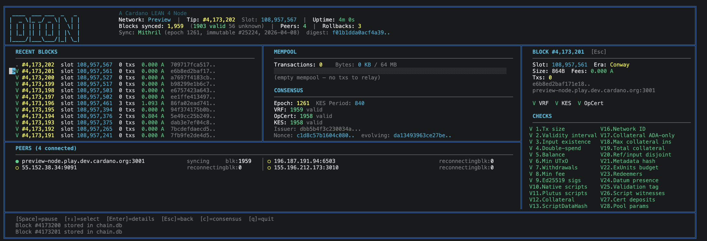

# Dion: A C/Lean Cardano Node

[](https://leanprover.github.io/)
[](https://cardano.org/)
[](https://docs.cardano.org/cardano-testnets/environments/)
[](https://mithril.network/)
[](LICENSE)

A Cardano node written in Lean 4, with formal proofs of critical protocol components.

Dion runs on Mainnet, Preprod, Preview, and SanchoNet. It can operate as a relay or as a stake pool operator (SPO) node that forges blocks.

> [!WARNING]
> **DO NOT USE THIS NODE IN PRODUCTION.**
>
> Dion is a research and educational project. It has not been audited, is not battle-tested, and makes no guarantees of correctness, safety, or availability. Running it on Mainnet with real funds or as a live stake pool is done entirely at your own risk.
>
> ALMOST EVERYTHING, INCLUDING THIS README, WAS VIBE CODED WITH LITTLE TO NO REVIEW.
> 
> **For production use, run the official [cardano-node](https://github.com/IntersectMBO/cardano-node).**



---

## Features

- **Full chain sync** — Ouroboros ChainSync + BlockFetch mini-protocols, multi-peer with reconnection
- **Block production** — VRF leader election, KES signing, block forging and announcement (Praos/Conway)
- **Mithril fast bootstrap** — skips weeks of replay by restoring from a certified snapshot, then replays the immutable DB to rebuild the UTxO set
- **Transaction validation** — fee, signature, native script, output-size, mint, certificate, and withdrawal checks (Plutus CEK via FFI for phase-2)
- **Mempool** — accepts and propagates transactions via TxSubmission2
- **N2C server** — Unix socket for `cardano-cli` compatibility (query tip, submit tx, local state query)
- **SPO tooling** — keygen, KES rotation, pool metadata, and pool registration end-to-end
- **TUI** — real-time dashboard showing sync progress, peers, mempool, forge stats, and next scheduled block slot
- **Formal proofs** — CBOR codec, socket protocol, mux framing, and ledger invariants verified in Lean 4

---

## Quick Start

### Prerequisites

- Lean 4 toolchain `v4.24.0` (via [`elan`](https://github.com/leanprover/elan))
- `lake` (bundled with Lean)
- Native deps: `libgmp`, `libcurl`, `libzstd`, `libbls12-381` (see [native/](native/))

### Build

```bash
lake build
```

The binary is at `.lake/build/bin/dion`.

### Run (relay, Preview testnet, Mithril bootstrap + TUI)

```bash
dion run --preview --mithril-sync --tui
```

### Run as SPO (block production)

```bash
dion run --preview --spo-keys ~/spo-keys/ --external-addr YOUR_IP:3001 --tui
```

---

## CLI Reference

### `dion run`

```
dion run [OPTIONS]
```

| Flag | Default | Description |
|------|---------|-------------|
| `--mainnet` / `--preprod` / `--preview` / `--sanchonet` | mainnet | Network to connect to |
| `--testnet-magic N` | — | Custom network magic (private testnets) |
| `--port N` | 3001 | Listen port for inbound peers |
| `--tui` | off | Enable full-screen TUI dashboard |
| `--mithril-sync` | off | Bootstrap from latest Mithril snapshot |
| `--skip-to-tip` | off | Intersect at chain tip immediately (skips catch-up) |
| `--spo-keys PATH` | — | Directory with SPO keys → enables block production |
| `--socket-path PATH` | — | Unix socket path for `cardano-cli` (N2C) |
| `--metrics-port N` | — | Expose Prometheus metrics on this port |
| `--external-addr IP:PORT` | — | External address advertised via PeerSharing |
| `--peer HOST:PORT` | — | Extra peers (repeatable) |
| `--epoch-nonce HEX` | — | Override epoch nonce (64-char hex) |
| `--epoch-length N` | — | Override epoch length in slots |
| `--system-start N` | — | Override slot-zero Unix timestamp |
| `--protocol-major N` | 10 | Protocol major version (10 = Conway, 9 = Babbage) |

### `dion query`

```
dion query tip        # chain tip (slot, block hash, era)
dion query peers      # connected peers and sync state
dion query mempool    # mempool stats and pending tx count
```

Reads from the running node's status file — no network round-trip.

### `dion spo`

```
dion spo keygen  [--dir PATH] [--kes-period N]
dion spo rotate-kes --dir PATH --kes-period N
dion spo metadata [--name STR] [--ticker STR] [--description STR] [--homepage URL] [--out FILE]
dion spo register --dir PATH --relay HOST:PORT [OPTIONS]
```

| Command | Description |
|---------|-------------|
| `keygen` | Generate all SPO keys: payment, stake, cold, VRF, KES, opcert |
| `rotate-kes` | Issue a new KES keypair and opcert from the existing cold key |
| `metadata` | Write `poolMetadata.json` and print its blake2b-256 hash |
| `register` | Build and submit the pool registration transaction via `cardano-cli` |

All key files are written in cardano-cli-compatible TextEnvelope JSON format.

### `dion replay`

```
dion replay failed_blocks/block_*.cbor
```

Parses and validates block CBOR files offline (fee, signatures, native scripts, Plutus). Useful for debugging validation failures saved to `failed_blocks/`.

---

## SPO Setup Walkthrough

1. **Generate keys**
   ```bash
   dion spo keygen --dir ~/spo-keys --kes-period 0
   ```

2. **Get your payment address and fund it**
   ```bash
   cardano-cli latest address build \
     --payment-verification-key-file ~/spo-keys/payment.vkey \
     --testnet-magic 2
   # fund from https://docs.cardano.org/cardano-testnet/tools/faucet/
   ```

3. **Generate pool metadata** (optional)
   ```bash
   dion spo metadata --name "My Pool" --ticker "POOL" --out poolMetadata.json
   # host poolMetadata.json at a public HTTPS URL
   ```

4. **Register the pool**
   ```bash
   dion spo register --dir ~/spo-keys --relay YOUR_IP:3001 \
     --metadata-url https://your-host/poolMetadata.json \
     --metadata-file poolMetadata.json
   ```

5. **Start the node**
   ```bash
   dion run --preview --spo-keys ~/spo-keys \
     --external-addr YOUR_IP:3001 \
     --mithril-sync --tui
   ```

6. **Rotate KES before expiry** (every ~62 evolutions ≈ 90 days on Preview)
   ```bash
   # Find current KES period: slot / 129600 (Preview)
   dion spo rotate-kes --dir ~/spo-keys --kes-period N
   # Then restart the node
   ```

---

## Project Structure

```
Dion/
├── CLI/           # Argument parsing, query commands, SPO tooling
├── Config/        # Topology, genesis parameters
├── Consensus/
│   └── Praos/     # Leader election (VRF), block forge, forge loop, stake distribution
├── Crypto/        # Ed25519, VRF (ECVRF), KES (Sum-KES-6), SHA-512, TextEnvelope
├── Ledger/        # UTxO, fee, validation, certificates, rewards, snapshots
├── Mithril/       # Snapshot download, certificate verification, ImmutableDB replay
├── Monitoring/    # Prometheus metrics, log levels
├── Network/       # CBOR, multiplexer, ChainSync, BlockFetch, TxSubmission2,
│   │              # PeerSharing, KeepAlive, Handshake, N2C protocols
│   └── N2C/       # Node-to-client: local state query, tx submission, tx monitor
├── Node/          # RelayNode orchestration, BlockApply, PeerSync, inbound peers
├── Proofs/        # Lean 4 formal proofs (CBOR, socket, mux, ledger phases 2–4)
├── Storage/       # BlockStore, ImmutableDB, VolatileDB, ChainDB
└── TUI/           # Terminal dashboard (ANSI, layout, state, render)
native/            # C FFI: blake2b, ed25519, VRF, KES, Plutus CEK evaluator
```

---

## Architecture Overview

```
┌─────────────────────────────────────────────────────┐
│                      RelayNode                      │
│  ┌──────────┐  ┌──────────┐  ┌────────────────────┐ │
│  │ PeerSync │  │ ForgeLoop│  │  N2C Server        │ │
│  │ (N2N)    │  │ (Praos)  │  │  (cardano-cli)     │ │
│  └────┬─────┘  └────┬─────┘  └────────────────────┘ │
│       │              │                              │
│  ┌────▼──────────────▼──────────────────────────┐   │
│  │          Ledger State (Mutex-protected)       │  │
│  │  UTxO · ProtocolParams · EpochFees · Certs   │   │
│  └──────────────────────────────────────────────┘   │
│                                                     │
│  ┌─────────────────┐  ┌──────────────────────────┐  │
│  │  ConsensusState │  │  Mempool                 │  │
│  │  (VRF, KES,     │  │  (pending txs)           │  │
│  │   stake snap)   │  └──────────────────────────┘  │
│  └─────────────────┘                                │
└─────────────────────────────────────────────────────┘
```

Peers are managed by `ConnectionManager`. Each peer runs `PeerSync` (ChainSync + BlockFetch), which applies blocks through `BlockApply` into the shared `LedgerState`. The `ForgeLoop` polls the current slot, checks VRF leadership, and announces forged blocks back to all peers. The N2C server exposes a Unix socket for `cardano-cli` tooling.

---

## Formal Verification

Dion uses Lean 4's dependent type system to prove correctness of critical components:

| Module | What is proven |
|--------|---------------|
| `Proofs.CborProofs` | CBOR round-trip and decode correctness |
| `Proofs.SocketProofs` | Socket send/receive framing invariants |
| `Proofs.MuxProofs` | Multiplexer demux correctness |
| `Proofs.Phase2Proofs` | UTxO state transition properties |
| `Proofs.Phase3Proofs` | Fee and value balance invariants |
| `Proofs.Phase4Proofs` | Block body validity conditions |

Proofs follow the [Cardano Blueprint](https://cardano-scaling.github.io/cardano-blueprint/) specifications.

---

## References

- [Cardano Blueprint](https://cardano-scaling.github.io/cardano-blueprint/) — Protocol specifications
- [Ouroboros Network Spec](https://ouroboros-network.cardano.intersectmbo.org/pdfs/network-spec/network-spec.pdf) — Network layer
- [Cardano Node](https://github.com/IntersectMBO/cardano-node) — Reference implementation
- [Cardano Ledger](https://github.com/IntersectMBO/cardano-ledger) — Ledger specifications
- [Mithril](https://mithril.network/) — Certified snapshots for fast bootstrap

---

## License

Apache License 2.0

Copyright (c) 2024–2025 Romain Soulat

Licensed under the Apache License, Version 2.0. See [LICENSE](LICENSE) for full terms.
